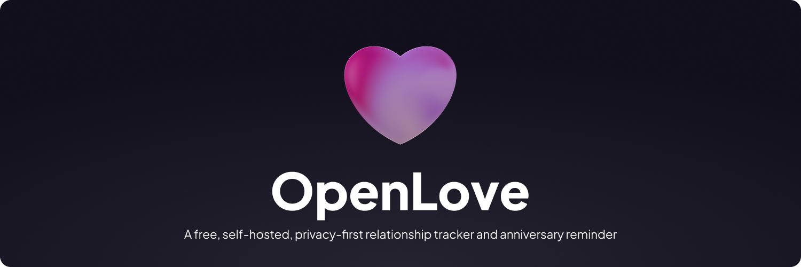

# OpenLove ❤️

> **A free, self-hosted, privacy-first relationship tracker and anniversary reminder alternative to "My Love".**

🔗 [Project website](https://frozdbyte.github.io/OpenLove/) · [Changelog](./CHANGELOG.md)

OpenLove allows couples to track how long they have been together with live counters, special multi-category milestones (months, years, days, custom), customizable romantic themes, and Web Push milestone alerts.

---

## ✨ Features

- 🔒 **Zero-Knowledge Privacy**: Names, anniversary dates, and high-resolution photos are stored locally on your device via **IndexedDB**. The server never stores your private memories or names — even if you opt in to sharing a photo with a partner (below), it's encrypted on your device first, so the server only ever holds unreadable ciphertext, briefly.
- 💖 **Multiple Bonds Support**: Track romantic relationships (💖) and friendships (🌿) with custom milestone preferences and separate profiles.
- 🎨 **Multiple UI Themes & Extensible Architecture**:
  - **Modern UI** *(Default)*: Clean, glassmorphic cards, glowing couple avatar, accent color palettes (*Rose, Lavender, Terracotta, Sage, Midnight*).
  - **Cover Image**: Full-bleed cover photo with clean top header and floating metric cards.
  - **Traditional UI**: Authentic, nostalgic replica of the classic "My Love" design with deep crimson header and stacked time breakdown.
  - *Per-Bond Customization*: Each bond can independently set its own UI theme, color palette, dark mode, and seconds display.
- 🌙 **Dark Mode Support**: Light, Dark, or System mode with crisp contrast across all views.
- 🏆 **Comprehensive Milestone Engine**:
  - **Months**: 1st through 11th month, 18 months, 30 months, etc.
  - **Years**: 1st anniversary, 5-year, 10-year, 25-year silver, 50-year golden, etc.
  - **Days**: 50, 100, 500, 1,000, 2,000, 5,000, 10,000 days (configurable: All, Major, or Off).
  - **Custom**: Add custom relationship memories (*First Date, Moved In, Proposal*).
- 📲 **Genuinely Offline-First PWA**: Installable to the Home Screen on iOS Safari, Android Chrome, and Desktop.
  The app shell, all JavaScript and CSS, and self-hosted fonts are precached, so it cold-starts
  with **no network at all** — airplane mode, force-quit, reopen, and the counter is still ticking.
- 🔄 **Offline Edits That Actually Sync**: Change your anniversary date with no connection and it is
  queued on-device, then delivered safely when back online.
- 🔒 **No Third-Party Requests**: Fonts are self-hosted — no IP leaks to external font CDNs.
- 🔔 **Anonymous Web Push Notifications**: Scheduled background cron alerts you on your exact milestone day in your local timezone (with generic single-bond and scoped multi-bond notices).
- 💾 **Progressive QR Share & Backup**: 1-tap backup/restore, instant QR code sharing with smart import previews and Add / Replace conflict resolution. JSON backup files (single-bond or full multi-bond) include your photo(s) too, so a restore brings everything back — this never touches the server, it's baked straight into the file you download.
- 🖼️ **Optional End-to-End Encrypted Photo Sharing**: Toggle "Share Photo" in the Share sheet to include your photo in a QR code or link too (it's normally left out to keep those small). Your photo is encrypted *on your device* before upload — the server only ever stores unreadable ciphertext, automatically deleted after a configurable TTL (default 24h). Self-hosters can disable the upload endpoint entirely with `FEATURE_SHARE_IMAGES=false` if they'd rather not accept any file upload on their server; JSON backups keep including photos either way, since those never touch the server.


---

## 🚀 Quickstart with Docker Compose

Deploy OpenLove in seconds using Docker:

```bash
# 1. Clone repository
git clone https://github.com/frozdbyte/OpenLove.git
cd OpenLove

# 2. Start container
docker compose up -d
```

Open [http://localhost:3000](http://localhost:3000) in your browser to start the onboarding wizard.

### Persistent Data
All SQLite records and auto-generated VAPID keys persist automatically in the `openlove_data` Docker volume (`/app/data`).

---

## ☁️ Deploy on Coolify

OpenLove ships with a ready-made Coolify compose file that pulls the pre-built image from Docker Hub.

1. In your Coolify dashboard, create a new **Docker Compose** service.
2. Point it to this repository or paste the contents of `docker-compose.coolify.yml`.
3. Set your domain in the Coolify UI — the `SERVICE_FQDN_OPENLOVE_3000` variable automatically routes it to the app.
4. Deploy. That's it — Coolify handles SSL, reverse proxy, and restarts.

> **Tip:** VAPID keys for push notifications are auto-generated on first boot into `/app/data/vapid.json`. To use your own, set `PUBLIC_VAPID_KEY`, `PRIVATE_VAPID_KEY`, and `VAPID_SUBJECT` in Coolify's environment variables tab.

---

## 🛠️ Local Development Setup

Ensure you have **Node.js 22+** and **pnpm** installed.

```bash
# 1. Install dependencies
pnpm install

# 2. Initialize database
pnpm prisma db push

# 3. Start development server
pnpm dev
```

The dev server will run at [http://localhost:5173](http://localhost:5173).

---

## ⚙️ Environment Variables

| Variable | Default | Description |
| :--- | :--- | :--- |
| `PORT` | `3000` | HTTP port for the web server |
| `DATABASE_URL` | `file:./data/openlove.db` | SQLite database connection string |
| `PUBLIC_VAPID_KEY` | *(Auto-generated)* | Public VAPID key for Web Push |
| `PRIVATE_VAPID_KEY` | *(Auto-generated)* | Private VAPID key for Web Push |
| `VAPID_SUBJECT` | *(auto)* | Contact address in push tokens. Must be a **public** domain — Apple rejects `.local`, `.lan`, `localhost` and bare IPs with `403 BadJwtToken`, delivering nothing to iOS. Leave unset for a safe fallback. |
| `FEATURE_SHARE_IMAGES` | `true` | Enables the optional encrypted photo-sharing relay (see Features above). Set to `false` to disable the public upload endpoint entirely; JSON backups still include photos regardless, since those never touch the server. |
| `SHARED_IMAGE_TTL_HOURS` | `24` | How long an uploaded encrypted photo stays available for a partner to fetch, in hours. Unlimited fetches within this window, not one-time-use. |

All feature toggles are read fresh on every request — flipping one and restarting the container takes effect immediately, no rebuild needed.

---

## 🔒 Privacy Architecture

OpenLove uses a **zero-knowledge, multi-couple architecture**:

```
+-------------------------------------------------------------+
|                      User Device (Browser)                  |
|  - Names, Start Date, High-Res Photos -> Stored in IndexedDB |
|  - Real-time time calculations & UI themes rendered locally |
+------------------------------+------------------------------+
                               | Anonymous Push Token & Date
                               v
+-------------------------------------------------------------+
|                   OpenLove Server (SQLite)                  |
|  - Stores ONLY: Push endpoint, crypto keys, date & timezone |
|  - Daily cron checks dates -> Dispatches milestone Web Push |
|  - NO names, NO photos, NO personal credentials on server   |
+-------------------------------------------------------------+
```

**One opt-in exception**: if you tap "Share Photo" when sending a QR code or link, your photo
is encrypted *on your device* first (AES-GCM, a fresh key every time) and only the unreadable
ciphertext is uploaded — the decryption key travels solely inside that same QR code/link,
never to the server. The server briefly holds ciphertext it cannot read, auto-deleted after
`SHARED_IMAGE_TTL_HOURS` (default 24h). This is off by default for every share; you turn it on
per-share, and it can be disabled server-wide with `FEATURE_SHARE_IMAGES=false`. JSON file
backups are unaffected either way — those embed your photo(s) directly in the file you
download, with no server involved at all.

---

## 📄 License

MIT License. Crafted with ❤️ for couples everywhere.
